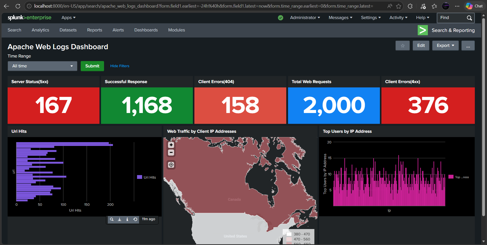
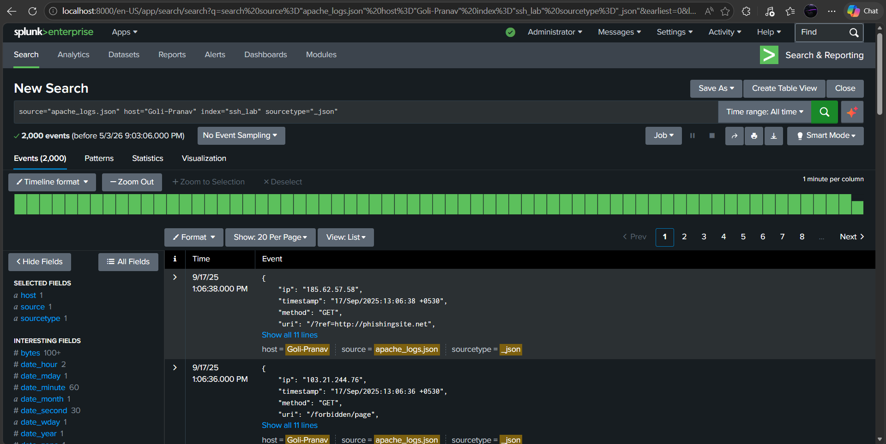
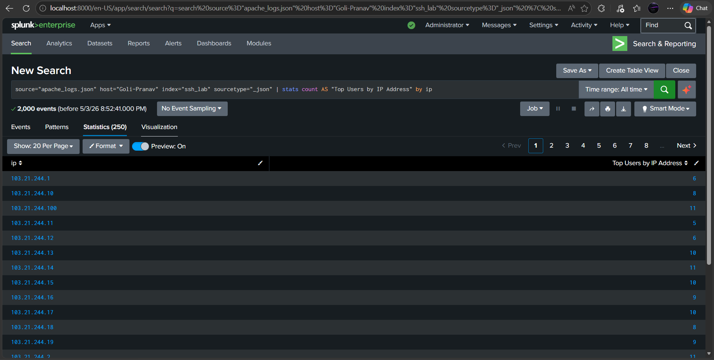
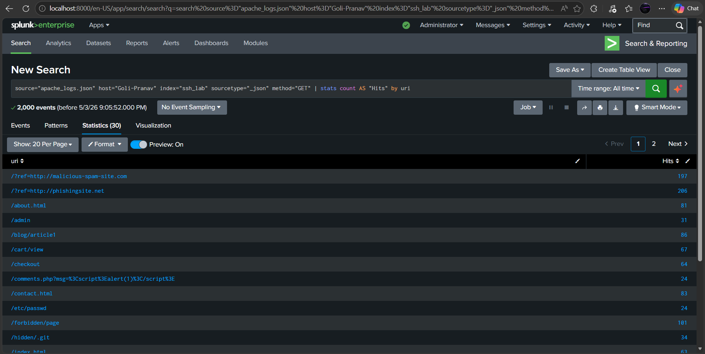
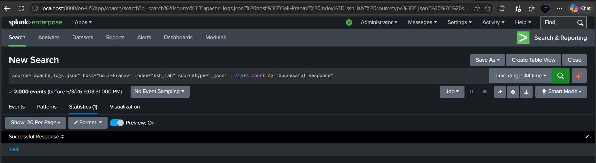
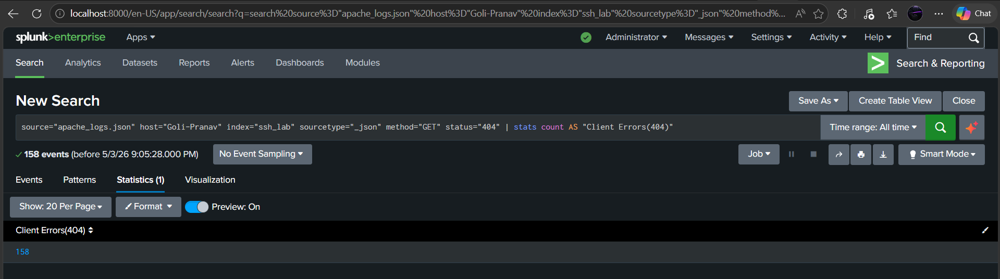

# Splunk SIEM: Apache Web Analytics & Security Intelligence Dashboard

## 📊 Project Overview
This project demonstrates an end-to-end "Data-to-Dashboard" pipeline. 
I engineered a custom Splunk environment to ingest, parse, and visualize Apache Web Logs, transforming raw HTTP telemetry into a high-visibility monitoring interface for security and, 
operational analysis.

## ✨ Key Features
Automated Ingestion: Configured Splunk to seamlessly index and parse structured .json web logs.

Granular Parsing: Deconstructed nested data to ensure critical fields like client_ip, status_code, and request_method are fully searchable.

Security Logic: Authored custom Search Processing Language (SPL) queries to identify potential threats like brute-force attacks and directory traversal.

Visual Analysis: Created a multi-panel dashboard providing real-time insights into traffic trends, geographic access patterns, and server health.

## 🛠️ Technical Stack
Platform: Splunk Enterprise

Query Language: SPL (Search Processing Language)

Data Source: Apache Web Logs (JSON)

Logic Framework: XML Dashboard

## 📂 Repository Structure
Apache_Web_Logs_Dashboard_Source_Code.xml: The core logic and visual architecture of the dashboard.

apache_logs.json: A sanitized sample dataset used to populate the visualizations.

README.md: Project documentation and technical overview.

## 🚀 How to Use This Project
Ingest Data: Upload the apache_logs.json file into your Splunk instance using the Add Data wizard.

Apply Logic: Create a new dashboard in Splunk, navigate to the Source view, and paste the contents of Apache_Web_Logs_Dashboard_Source_Code.xml.

Analyze: Use the visual panels to monitor for traffic anomalies and investigate potential security events.

## 📸 Dashboard Preview

## 💡 Why This Project Matters
In a modern SOC environment, the ability to rapidly parse web telemetry is critical for incident response. This project reflects my commitment to mastering the data engineering side of security—ensuring that raw logs become actionable intelligence that reduces MTTR (Mean Time to Respond).
